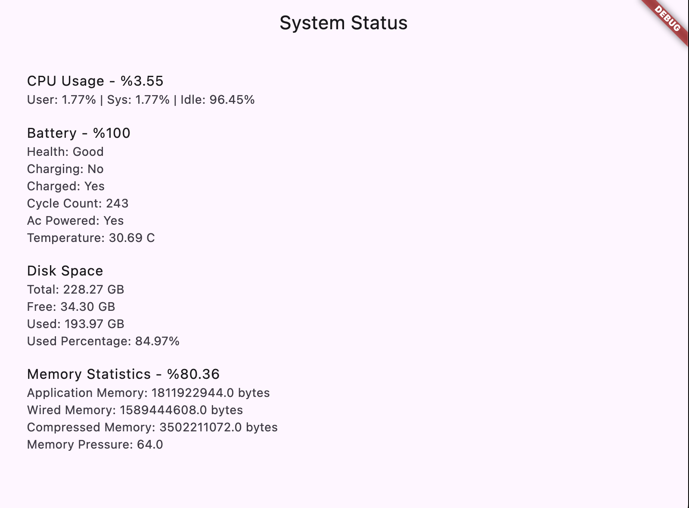

# system_status

<!--  -->


system_status is a Flutter plugin that provides system status monitoring capabilities for MacOS computers. It allows you to monitor and display real-time statistics of RAM, battery, storage, and CPU usage.

## Features

- Real-time monitoring of system resources: RAM, battery, storage, and CPU.
- User-friendly interface for easy integration and usage.
- Supports MacOS 10.14 and above.
- Low system resource usage, optimized for performance monitoring without overhead.

## Installation

To use this plugin, add `system_status` as a dependency in your `pubspec.yaml` file.

```yaml
dependencies:
  flutter:
    sdk: flutter
  system_status: ^1.0.7
```

Then, import the package where you need to use it:


```yaml
import 'package:system_status/system_status.dart';
```

## Usage

```Dart
// Initialize the plugin
SystemStatusMacOS systemStatus = SystemStatusMacOS();

// Get system status information
void getSystemStatus() async {
  try {
    SystemStatusModel? status = await systemStatus.getSystemStatus();
   
    print('System Status: ${status}');
  } catch (e) {
    print('Error retrieving system status: $e');
  }
}
```



